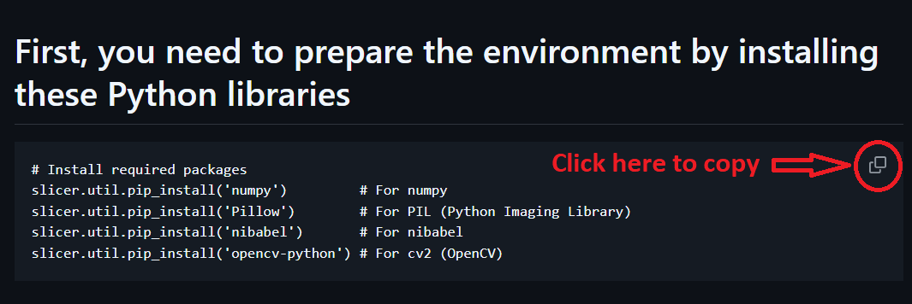
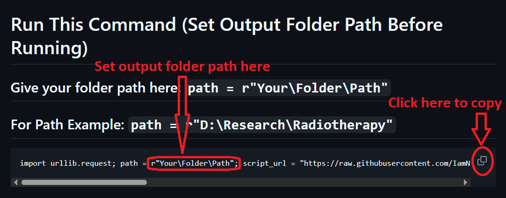

# First, you need to prepare the environment by installing these Python libraries
```
# Install required packages
slicer.util.pip_install('numpy')         # For numpy
slicer.util.pip_install('Pillow')        # For PIL (Python Imaging Library)
slicer.util.pip_install('nibabel')       # For nibabel
slicer.util.pip_install('opencv-python') # For cv2 (OpenCV)
```


# Run This Command (Set Output Folder Path Before Running)
##  Give your folder path here: ``` path = r"Your\Folder\Path" ```
## For Path Example: ``` path = r"D:\Research\Radiotherapy" ``` 

```
import urllib.request; path = r"Your\Folder\Path"; script_url = "https://raw.githubusercontent.com/IamNishanKhan/RadioTherapy/main/version6.5.py"; script_content = urllib.request.urlopen(script_url).read().decode('utf-8'); modified_script = script_content.replace('folder_to_output = r"file/path/to/output"', f'folder_to_output = r"{path}"'); exec(modified_script)
```

<br>

<br>

<br>
<div align="center" style="background-color: white; padding: 10px; border-radius: 8px;">
  
# Image Guideline
<div align="center" style="background-color: white; padding: 10px; border-radius: 8px;">  </div>
<br>

<br>
<div align="center" style="background-color: white; padding: 10px; border-radius: 8px;">  </div>
</div>
